#  期中作业项目文档

   本次项目实现了基于Note_pad笔记本的一些基本功能的实现，其中分为两个必需功能和两个扩展功能。

   下面将对这四个功能进行效果展示和关键源码的截图展示。

## 一、必需功能

### 1.时间戳的添加

​    对notePad添加时间戳

​	以下是其效果图

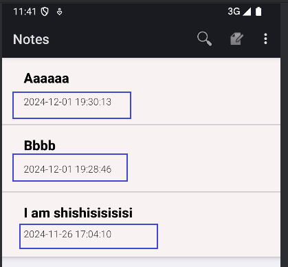

   首先，在 `notelist_item.xml` 文件中添加一个文本框布局，用于显示时间戳。接着，在数据库查询中，将创建日期和修改日期的列添加到 `PROJECTION` 数组中，以便能够从数据库中获取这些时间信息。之后，更新数据映射中的 `dataColumns` 和 `viewIDs` 数组，以确保 `SimpleCursorAdapter` 能正确地将时间戳显示在 `ListView` 中。

然后，调整 `SimpleCursorAdapter` 的设置逻辑，确保它使用来自 `Cursor` 的时间戳数据，并进行相应的格式化。为此，可以通过使用一个 `CursorToViewBinder` 来处理数据和视图的绑定，从而在将数据绑定到视图时格式化时间戳，使其以用户友好的形式呈现。

​     关键代码截图如下：
   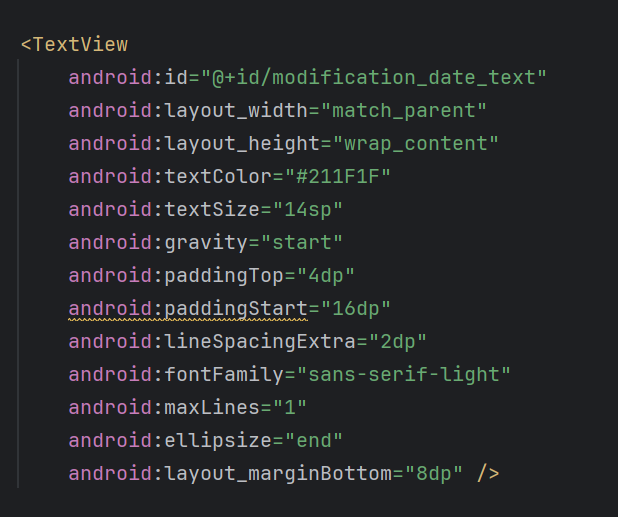

 
    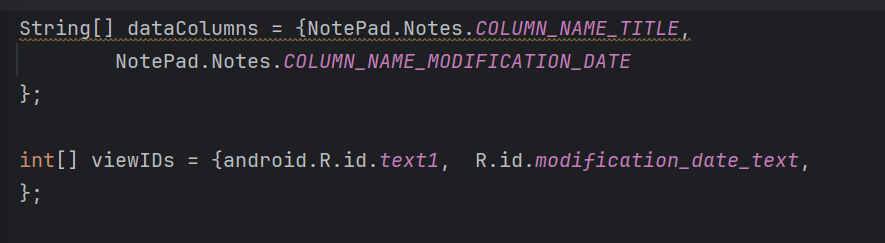

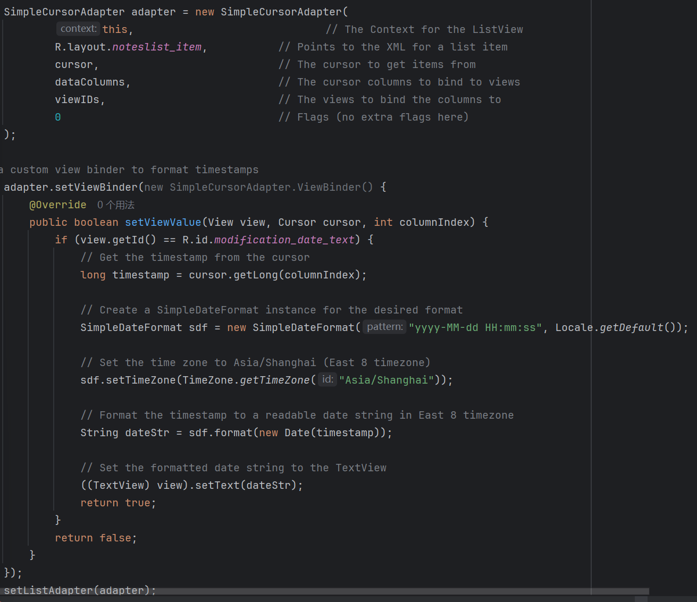

###      2.搜索功能的添加

  为notepad添加搜索功能，使notepad实现能以笔记标题或者内容作为关键词进行模糊查询

​	以下使其效果图
   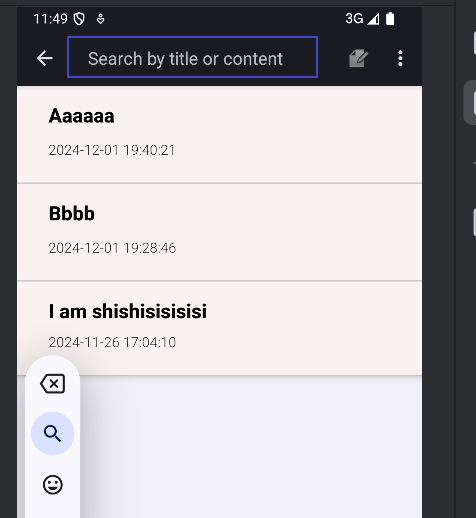
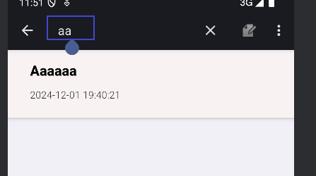
 对内容进行搜索

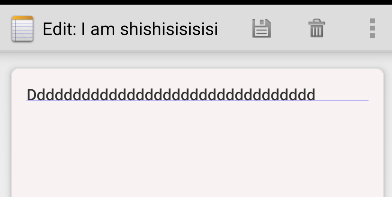

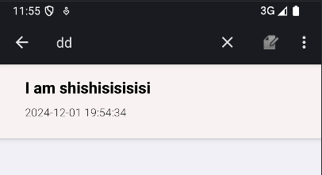

   具体实现：

   在list_options_menu.xml中加入搜索框进行输入搜索。菜单中添加一个 SearchView，用于捕捉用户输入并根据输入搜索笔记。并   创建一个方法来根据搜索条件查询笔记。

   关键代码截图如下：

   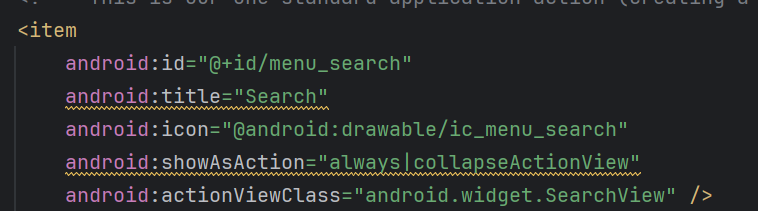

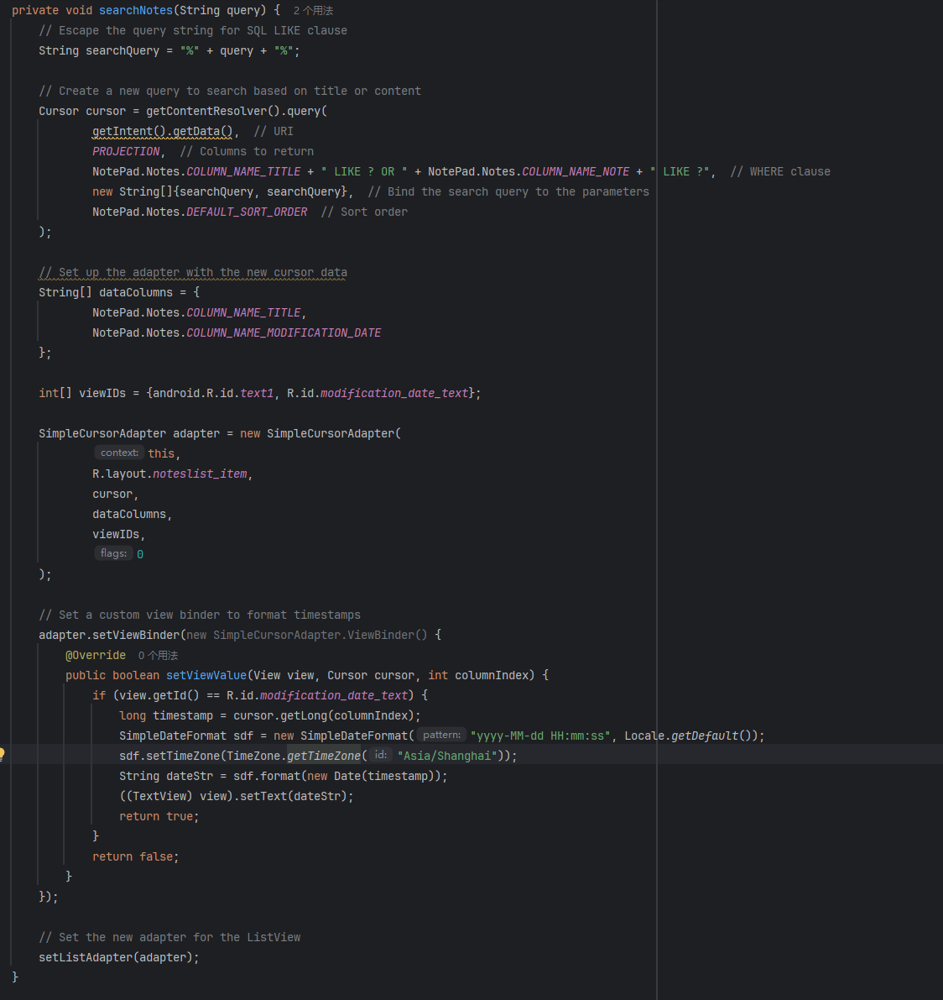

##    二 附加功能

###    1.UI美化

####    1.1 对notepad的主页编辑页进行了一些UI美化

##### （1）字体颜色和层次感

- **标题颜色**：标题文字的颜色选用了深色（#020202），增强了文字的可读性和视觉突出性。
- **日期颜色**：日期文字采用了较浅的灰色（#211F1F），通过颜色对比进一步提升层次感，使得标题与日期的视觉区分更加明显。

##### （2）**字体大小与加粗**

- **标题字体大小**：标题文字的字体大小被设置为 20sp，并且采用加粗（`textStyle="bold"`），使其更加引人注目，提升页面的视觉重点。
- **日期字体大小**：日期文字的字体大小设置为 14sp，较小的字体使得日期信息清晰且不喧宾夺主，营造出一种信息层级感。

##### （3） **内外边距与布局调整**

- **文本内边距**：通过设置 `paddingStart="16dp"` 和 `paddingEnd="16dp"`，确保文本内容不会与屏幕边缘过于接近，提供了更大的可读空间。
- **LinearLayout边距**：通过为 `LinearLayout` 添加 `android:layout_margin="8dp"`，确保该组件在整个布局中的适当位置，避免元素紧凑，提供了更宽松的排版效果。
- **文本底部间距**：为标题文本添加了 `android:layout_marginBottom="4dp"` 的外边距，使得标题与日期之间的间距适当，避免两者过于紧凑。

##### （4） **行间距**

- **标题行间距**：在标题的 `TextView` 中设置了 `lineSpacingExtra="4dp"`，使得行间距适中，提升了可读性。
- **日期行间距**：日期文本的行间距设置为 `2dp`，保留了一定的间隙，但依然保持信息的紧凑性。

##### （5） **阴影与背景设计**

- **阴影效果**：通过为 `LinearLayout` 设置 `elevation="4dp"`，为整个布局增添了阴影效果，提升了界面的立体感和层次感，使UI更加现代。
- **背景颜色**：为背景设置了柔和的浅色（#F8F2F2），这样不仅不会过于突兀，还能让内容更加突出，整体视觉感更为舒适。

##### （6） **溢出处理**

- **标题文字溢出**：使用 `ellipsize="end"` 和 `maxLines="1"` 的属性来处理标题的文字溢出，确保当标题过长时能够显示省略号（`...`），避免界面排版被破坏。
- **单行限制**：限制标题和日期文字为单行显示，保证文字排版整洁，同时在空间不足时进行文字裁剪和省略。

##### （7）**字体与排版样式**

- **字体家族**：标题文本采用了 `sans-serif-medium` 字体，使其具有现代感和良好的可读性；日期则使用了 `sans-serif-light` 字体，提供轻盈、简洁的效果，增强层次对比。
- **文本对齐方式**：标题采用了 `android:gravity="start|center_vertical"`，确保文本既对齐于左边，又保持垂直居中，增强整体排版的整洁感；日期文字则采用了 `gravity="start"`，保持文本从左边开始排布，清晰易读。

   效果图如下：

   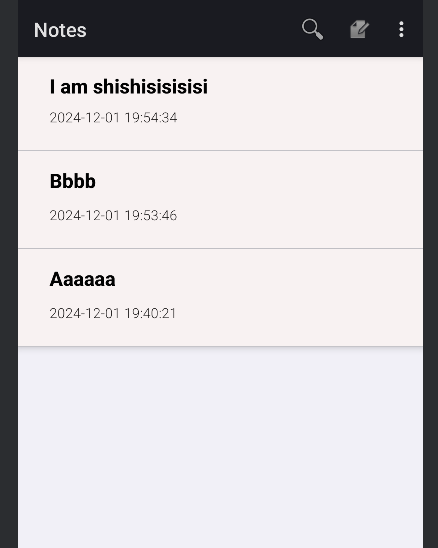

#### 1.2对编辑页面进行UI优化后的好处

##### （1） 更加**良好的用户交互体验**

- **可编辑和可焦点**：通过 `android:focusable="true"` 和 `android:focusableInTouchMode="true"` 属性，确保该视图在触摸模式下能够正确地获取焦点并进行输入，提升用户操作的便捷性。
- **多行输入支持**：设置 `android:inputType="textMultiLine|textCapSentences"`，允许用户输入多行文本，并自动首字母大写，这适用于笔记类应用。
- **滚动支持**：启用垂直滚动条 (`android:scrollbars="vertical"`) 和 `android:overScrollMode="always"`，让长文本输入时可以滚动显示，避免文本溢出，并为用户提供清晰的滚动反馈。
- **渐变边缘效果**：`android:fadingEdge="vertical"` 设置了垂直方向的渐变边缘效果，提升滚动体验，让用户明确知道文本内容的边界。

##### （2） **视觉设计优化**

- **文本样式与字体**：`android:textSize="16sp"` 和 `android:fontFamily="sans-serif-medium"` 设置了适中的字体大小和现代化的字体，增强了文本的可读性和美观度。
- **文本颜色**：`android:textColor="#333333"` 和 `android:textColorHint="#BBBBBB"` 配置了适当的文本和提示文字颜色，提升可读性同时减少视觉疲劳。
- **背景样式**：使用自定义背景 `android:background="@drawable/edittext_background"`，可以设置背景样式（例如圆角、边框、阴影等），使得输入框更符合应用的整体设计风格。
- **内外边距与布局**：`android:padding="16dp"` 和 `android:layout_margin="16dp"` 确保了输入框与其他元素之间有适当的间距，避免界面元素过于紧凑，提升布局的整洁感和舒适感。

##### （3） **响应式设计和适配**

- **最大行数设置**：`android:maxLines="20"` 限制输入框的最大行数，防止过长的文本影响界面的整体布局，同时为不同尺寸的设备提供了一定的自适应性。
- **布局适配**：`android:layout_width="match_parent"` 和 `android:layout_height="match_parent"` 保证输入框占据整个父容器的宽高，适配各种屏幕尺寸，确保布局的一致性。

##### （4） **增强的触摸反馈与触感设计**

- **高亮效果**：`android:layout_gravity="center"` 和 `android:elevation="4dp"` 使得输入框居中显示，并通过 `elevation` 提供了一定的阴影效果，增强了界面层次感和互动性。
- **点击效果**：通过 `android:focusable="true"` 和自定义背景，可以为用户提供更好的点击反馈，确保触摸体验顺畅。

   效果图如下：
   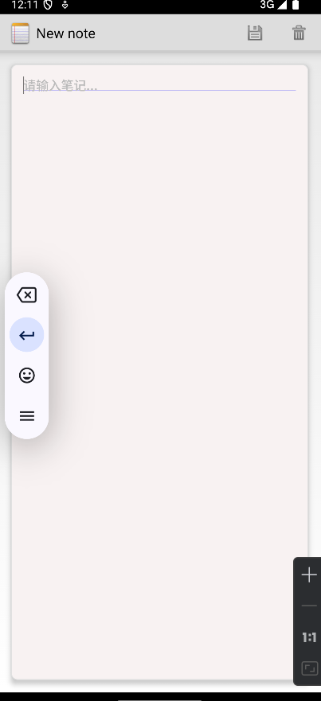
   主要源码如下

  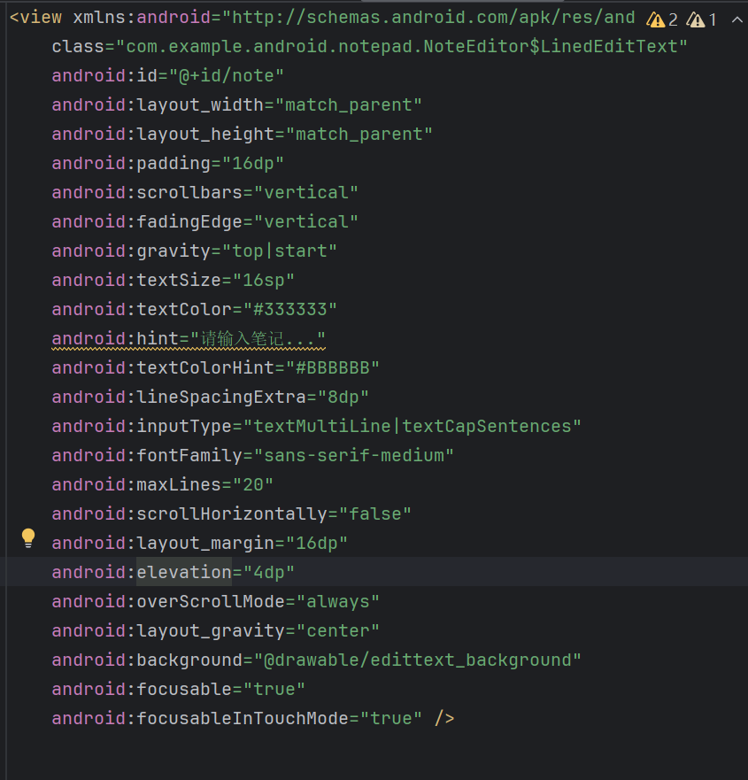

###    2.添加导出笔记功能

   为notepad添加了导出笔记功能，可导出到手机的文件中

   导出的文件内容包括笔记标题，笔记内容和笔记编辑时间。
   以下为其效果图：
   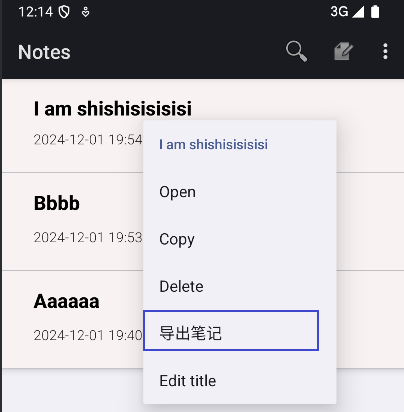

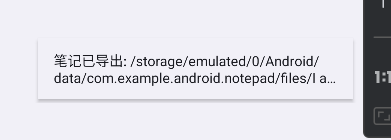

​    根据显示的路径找到导出文件：
​    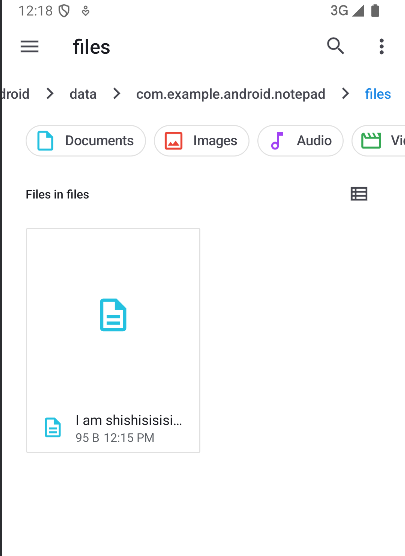
​     主要代码如下：
​     
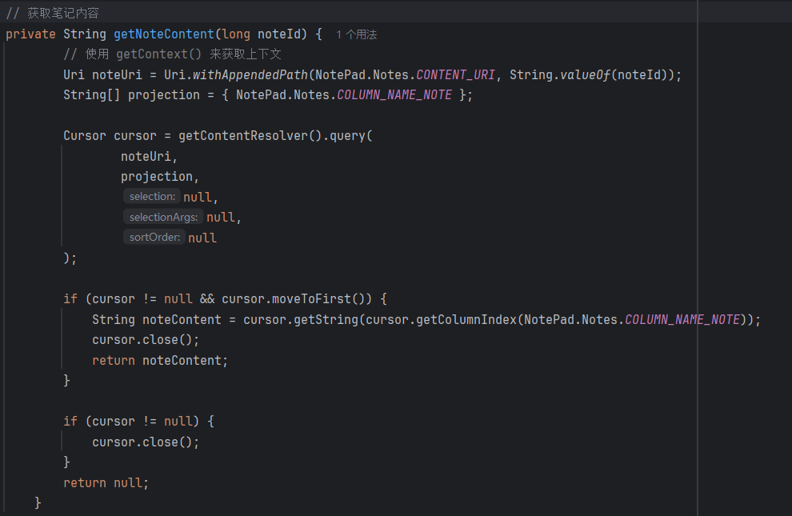
​     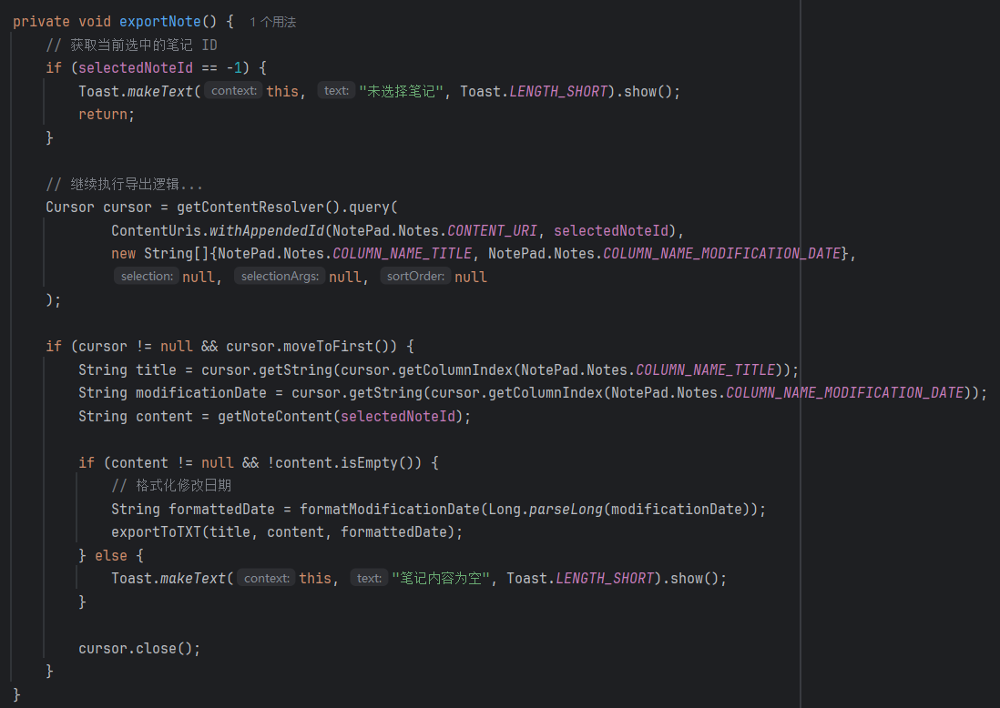

​      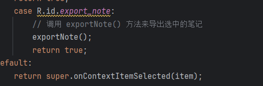